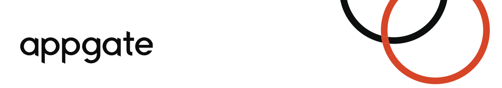

# Como ejecutar este código.

Para ejecutar este código y llenar la prueba tienes un ambiente completamente configurado con [devcontainers](https://code.visualstudio.com/docs/remote/create-dev-container) de Visual Studio Code.

Asegurese de tener instalado y configurado [Docker Engine](https://docs.docker.com/engine/install/).

Abra la carpeta en Visual Estudio Code y luego use el sigueinte comando

**ctrl+shift+p** y escriba *reopen in...*

Seleccione la opción **Rebuild and Reopen in Container**

El ambiente de desarrollo creado en el contenedor le proveerá lo siguiente

* Instalación de Java 11

* Instalación de Maven

* Instalación de NodeJS

* Instalación de postgresql

* Instalación de MongoDB

* Un ambiente de Debian 10 Buster

También puede no hacer uso de estos ambientes preinstalados pero debeŕa configurarlos en su propio ambiente de desarrollo.

# Acerca de la prueba.

La prueba busca tener una idea de sus conocimientos en diferentes áreas, pero más que eso quiere ser un reto para ver su capacidad de resolución de problemas y aprendizaje. Si no puede hacer algo, pero tiene una idea de como debería hacerse por favor describala en el espacio de solución.

# Bienvenido a DMS.

Gracias por querer ayudarnos a satisfacer nuestros clientes y a mejorar la calidad de nuestros procesos y productos.

## Java

Muchos de nuestros procesos corren sobre **Java** así que esperamos un conocimientó básico del lenguaje que te permita comprender los errores generados en los logs de nuestras aplicaciones. Usualmente las manejamos con [Maven](https://maven.apache.org/index.html)

Llena la prueba de conceptos generales [preguntas](Java.md)

Ejecuta el siguiente comando para generar un arquetipo de maven

```bash
mvn -B archetype:generate -DgroupId=com.appgate.dtp.l2 -DartifactId=test-app -DarchetypeArtifactId=maven-archetype-quickstart 
```
Con el comando anterior acabas de crear las capertas donde deberás escribir el código Java respectivo.

Ahora hay una carpeta **test-app** y en ella la estructura básica de un proyecto Java. en la clase [App.java](test-app/src/main/App.java) puede crear el código para los siguientes requerimientos.

### Requerimiento

Usando conceptos de POO (Programación orientada a objetos) crea una aplicación que leea el arhivo de [dominios](data/dominios.txt) y guarde a un archivo csv los resultados agregados de cada TLD.

| TLD   | Cantidad  |
|---|---|
| academy| 63 |


## SQL (postgresql)

El ambiente le provee el una base de datos Postgresql 11. Inice la base de datos con el siguiente comando

```bash
 sudo service postgresql start
```
puede conectarse a la misma usando

```bash
 psql vscode
```

### Requerimiento:

Con el archivo de csv de TLD,cantidad, cree un ** Shell Script ** en la carpeta sql que cree una tabla para almacenar esta información en la tabla respectiva.

### Requerimiento:

Con el archivo [dominios.txt](data/dominios.txt) cree un ** Shell Script ** en la carpeta sql que cree una tabla para almacenar esta información en la tabla respectiva.

## Javascritp (MongoDB)

El ambiente también provee una base de datos de Mongo DB.

sudo mongod --fork --logpath /var/log/mongodb/mongod.log  --dbpath /data/mongodb/

### Requerimiento:

Cree un script para la base de datos de mongodb que cargue el csv de TLD,Cantidad, cree la respectiva collección y cargue la información respectiva.

## Shell scripting.

Las instrucciones de almancenamiento en base de datos deben ser creadas por medio de shell script almacenados en las carpetas
de SQL y JSON

## Docker

Realice una explicación de como este devcontainer provee los diferentes ambientes.

Llena la prueba de conceptos generales [preguntas](Docker.md)

## Git

El resuldado del código de Java más los script de base de datos y las respuestas de la carpeta pregunta deben ser guardados en un repositorio git y entregar el resultado.
